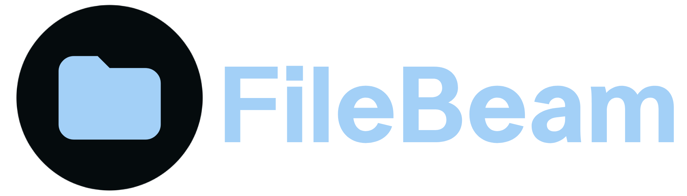

  
  <h1>Jorge#603</h1>
  <strong>21 años</strong> - <strong>MX</strong> - <strong>Desarrollador Backend</strong> - <strong>Intento de Sysadmin</strong>

   
   

  

  <h2>Lenguajes, tecnologías y S.O que suelo usar...</h2>

  <h4>Lenguajes y frameworks</h4>
  
  
  
  

  <h4>Tecnologías</h4>
  
  
  
  
  <h4>Sistemas Operativos (de Servidor)</h4>
  
  
  
  

  <h2>Por aprender...</h2>
  
  
  
  

  <h2>Proyectos Actuales</h2>

  

    
  

  

